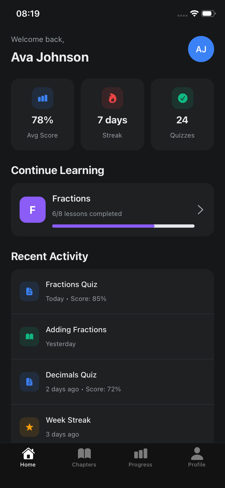
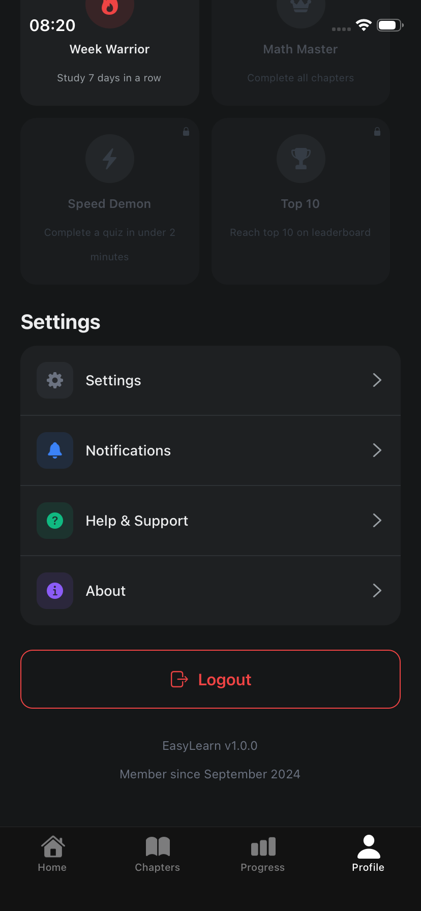
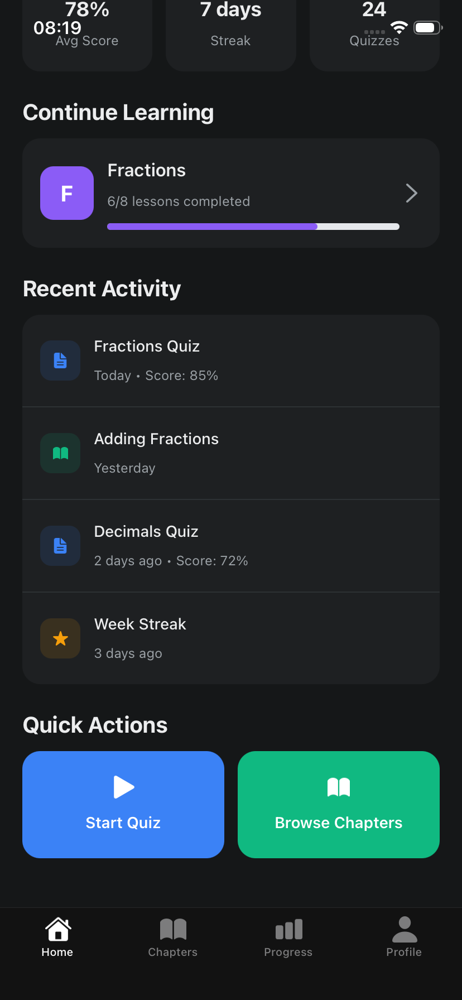
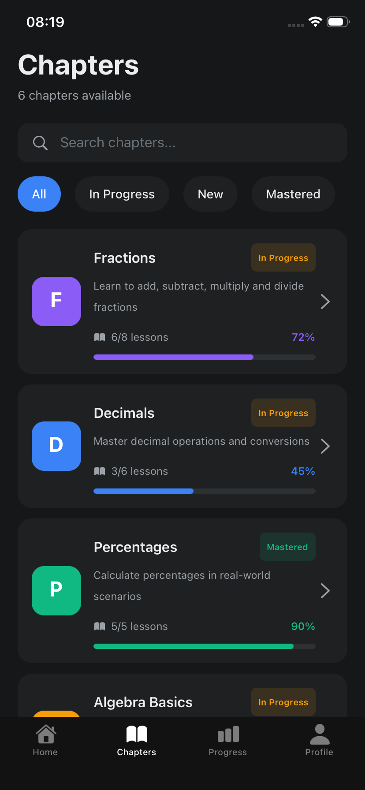
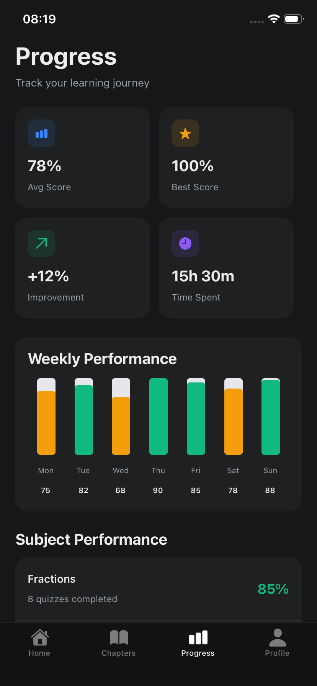
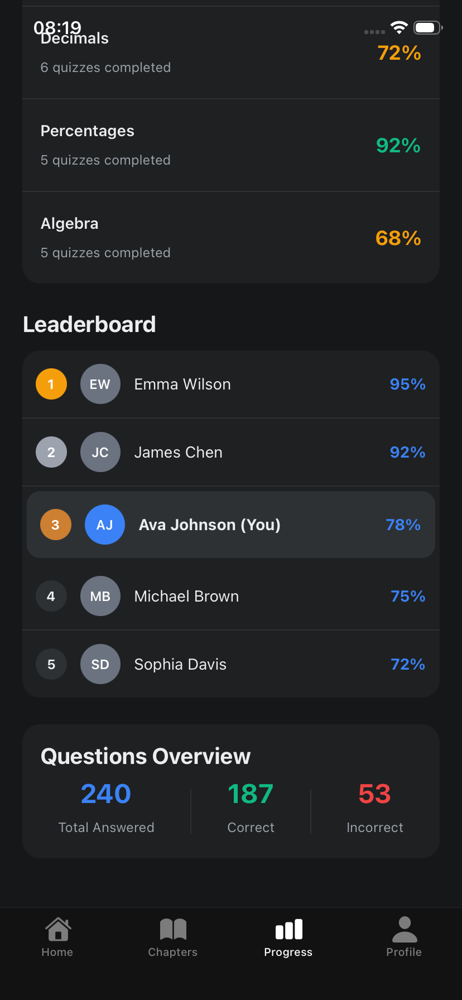

# **EasyLearn — Intelligent Quiz Generation & Student Performance Analytics**

EasyLearn is an AI-powered learning assistant that helps teachers automatically generate quizzes from PDFs and analyze student performance in real-time. With AI-generated quizzes, intelligent dashboards, and automated insights, EasyLearn helps teachers understand each student’s strengths and weaknesses—something traditional classrooms often struggle to provide.

Developed for the **Provincial Phase Rupandehi — CodeFest 2025**, organized by **Code for Change Rupandehi** on **November 21–22, 2025**.

---

## **Badges**


---

## 🚀 **Features**

- **AI-Powered Quiz Generation** from PDFs using LangChain + Gemini.
- **Student Quiz Portal** for seamless quiz attempts.
- **Automated Performance Analytics** with insights & weakness detection.
- **Teacher Dashboard** for class monitoring and student progress tracking.
- **Cross-Platform Support** via Web (Next.js) + Mobile (Expo).
- **Secure & Scalable Backend** powered by Express + MongoDB.

---

## 🏗️ **Project Structure**

```
TeamLCCElite
│
├── App (Expo App)
│   ├── app
│   ├── assets/images
│   ├── components
│   ├── constants
│   ├── data
│   ├── hooks
│   └── scripts
│
├── Backend
│   └── src
│       ├── controllers
│       ├── middleware
│       ├── lib
│       ├── model
│       ├── routes
│       ├── utils
│       ├── env.ts
│       ├── server.ts
│       └── test.ts
│
└── frontend
    ├── app
    │   ├── admin
    │   ├── auth
    │   ├── student
    │   │   ├── classes
    │   │   ├── dashboard
    │   │   ├── progress
    │   │   ├── quizzes
    │   │   └── layout.tsx
    │   ├── teacher
    │   │   ├── analytics
    │   │   ├── classes
    │   │   ├── dashboard
    │   │   ├── quizzes
    │   │   └── layout.tsx
    │   ├── globals.css
    │   ├── layout.tsx
    │   └── page.tsx
    │
    ├── components
    ├── hooks
    ├── lib
    ├── public
    ├── styles
    ├── next-env.d.ts
    ├── next.config.mjs
    ├── package.json
    ├── package-lock.json
    ├── postcss.config.mjs
    ├── tsconfig.json
    └── components.json

```

---

## 📸 **Screenshots**

<details>
<summary>Student Mobile View (Tap to expand)</summary>









</details>

<details>
<summary>Admin View (Tap to expand)</summary>


</details>

<details>
<summary>Teacher View (Tap to expand)</summary>


</details>

## 🎥 **Demo**

App demo

<video controls src="./screenshots/exportVideo2025-11-22 081746.mp4" title="Title"></video>

### **🔗 Live Demo (Frontend)**

**https://your-demo-link.com**

---

### **🔗 Presentation Link**

- [Click Here to View](https://www.canva.com/design/DAG5Fok3S0w/o8kL4BLZsiuWnDZrlNeh4g/edit?utm_content=DAG5Fok3S0w&utm_campaign=designshare&utm_medium=link2&utm_source=sharebutton)

## 🧠 **Tech Stack**

### **Frontend**

- Next.js 14 (App Router)
- Tailwind CSS
- TypeScript

### **Backend**

- Node.js
- Express
- MongoDB / Mongoose

### **AI & NLP**

- LangChain for PDF parsing
- Gemini AI Model for quiz generation

### **Mobile App**

- Expo React Native

---

## 🔍 **How It Works**

1. **Teacher uploads a PDF** (notes, chapters, assignments, textbooks, etc.).
2. PDF content is extracted using **LangChain**.
3. **Gemini AI** generates:
   - Multiple-choice questions
   - True/False
   - Short-answer questions
4. Students take quizzes on the web app or mobile app.
5. System analyzes:
   - Accuracy
   - Topic-wise understanding
   - Response patterns
6. Teachers get an AI-powered dashboard showing:
   - Individual progress
   - Class-wise insights
   - Weak topics
   - Recommendations

---

## 👨‍💻 **Team Members**

| Name                 | Role               |
| -------------------- | ------------------ |
| **Bijay Dhakal**     | Frontend Developer |
| **Bibek Bhusal**     | Backend Developer  |
| **Aabishkar Dhenga** | Product Manager    |
| **Supriya Shrestha** | UI/UX Designer     |

---

## 🏆 **Event**

This project was created for:

### **Provincial Phase Rupandehi — CodeFest 2025**

Organized by **Code for Change Rupandehi**  
📅 **November 21–22, 2025**

---

## 📦 **How to run**

### **1. Clone the Repository**

- [Download ZIP](https://github.com/bibek-bhusal03/EasyLearn/archive/refs/heads/main.zip), or
- Clone with Git:

```bash
git clone https://github.com/TeamLCCElite/EasyLearn.git
cd TeamLCCElite

```

### **2. Install Dependencies**

Frontend

```bash
cd frontend
npm install
npm run dev

```

Backend

```bash
cd backend
npm install --legacy-peer-deps
npm run dev

```

- Note: Create .env file in backend folder with the following:

```
PORT=5000
JWT_SECRET=super_strong_secret_change_in_production_12345
DATABASE_URL=
# Cloudinary (get from https://cloudinary.com/console)
CLOUDINARY_CLOUD_NAME=
CLOUDINARY_API_KEY=
CLOUDINARY_API_SECRET=

GEMINI_API_KEY=
```

Expo App

```bash
cd App
npm install
npx expo start

```

### 📄 License

This project was developed for competition and educational purposes during CodeFest 2025.
